# What is this?
This is my NVIM config. It is based on the basic config by [rafaeldelboni](https://github.com/rafaeldelboni) to set up NVIM in a powerful Clojure IDE using fennel, clojure-lsp and conjure.  

## Prerequisites
Things you need installed in your OS to use this setup
- [git](https://git-scm.com/downloads)
- [nvim](https://neovim.io/)
- [rg](https://github.com/BurntSushi/ripgrep)
- [clojure-lsp](https://github.com/clojure-lsp/clojure-lsp)

## How to use

**Make sure you backup your current configuration files in `$HOME/.config/nvim` (Linux) or `%AppData%/Local/nvim` BEFORE running this.**  

When you start nvim for the first time it will download packer and aniseed and show some errors, thats normal press enter to ignore and go to the nvim console pressing `:` and type `PackerInstall`.
This will install all plugins declared in `fnl/config/plugin.fnl`, after packer's panel showing all the plugins where installed, close nvim and open it again, no errors should show up this time.

## Plugins
 - [packer](https://github.com/wbthomason/packer.nvim) *Plugin/package management*
 - [aniseed](https://github.com/Olical/aniseed) *Bridges between fennel and nvim*
 - [conjure](https://github.com/Olical/conjure) *Interactive repl based evaluation for nvim*
 - [telescope](https://github.com/nvim-telescope/telescope.nvim) *Find, Filter, Preview, Pick*
 - [treesitter](https://github.com/nvim-treesitter/nvim-treesitter) *Incremental parsing system for highlighting, indentation, or folding*
 - [nvim-lspconfig](https://github.com/neovim/nvim-lspconfig) *Quickstart configurations for the Nvim LSP client*
 - [nvim-cmp](https://github.com/hrsh7th/nvim-cmp) *Autocompletion plugin*
 - [github-nvim-theme](https://github.com/projekt0n/github-nvim-theme) *Github theme for Neovim*

## Files

### [init.lua](https://github.com/rafaeldelboni/nvim-fennel-lsp-conjure-as-clojure-ide/blob/main/.config/nvim/init.lua)
Wrapper responsible for two things:
  - Download and setup our package manager ([packer.nvim](https://github.com/wbthomason/packer.nvim)) and our fennel helper/interface ([aniseed](https://github.com/Olical/aniseed))
  - Set the entrypoint for NVIM read our config files, in our case `fnl/config/init.fnl`.

### [fnl/config/init.fnl](https://github.com/rafaeldelboni/nvim-fennel-lsp-conjure-as-clojure-ide/blob/main/.config/nvim/fnl/config/init.fnl)
- Set basic global vim configurations and general keymaps.
- Load plugin configuration namespace.

> In this file among other settings I do set the leader key as `space` and local-leader as `,`.


### [fnl/config/plugin.fnl](https://github.com/rafaeldelboni/nvim-fennel-lsp-conjure-as-clojure-ide/blob/main/.config/nvim/fnl/config/plugin.fnl)
Here we define the plugins we want packer to download and load for us, we define here a private function called `use`
which will search in the plugin map for the keyword `:mod` and load the namespace defined in its value.

For example in the line we define that we need telescope we have this map:
```clojure
  :nvim-telescope/telescope.nvim {:requires [:nvim-lua/popup.nvim
                                             :nvim-lua/plenary.nvim]
                                  :mod :telescope}
```
This will state to packer download `nvim-telescope/telescope.nvim` and all the required plugins in `:requires` and search for the namespace `telescope`
in file located in the following path `fnl/config/plugin/telescope`, where I usually add plugin specific configuration like keymaps and settings.

### [fnl/config/plugin/conjure.fnl](https://github.com/rafaeldelboni/nvim-fennel-lsp-conjure-as-clojure-ide/blob/main/.config/nvim/fnl/config/plugin/conjure.fnl)
Conjure specifics settings, I like to remap the doc work keymap to be `<localleader>K` instead the only `K`, to not conflict with the LSP docs `K`.

### [fnl/config/plugin/telescope.fnl](https://github.com/rafaeldelboni/nvim-fennel-lsp-conjure-as-clojure-ide/blob/main/.config/nvim/fnl/config/plugin/telescope.fnl)
Settings like ignore `node_modules` and everything in `.gitignore` to be listed in the file finder.  
Keymaps:
 - `<leader>ff` open the find files
 - `<leader>fg` open the fuzzy finder
 - `<leader>fb` open the find open buffer
 - `<leader>fh` open the nvim help fuzzy finder

### [fnl/config/plugin/treesitter.fnl](https://github.com/rafaeldelboni/nvim-fennel-lsp-conjure-as-clojure-ide/blob/main/.config/nvim/fnl/config/plugin/treesitter.fnl)
Settings to select which treesitter's features we want enabled and which language extension we want to ensure they will be always installed.

### [fnl/config/plugin/lspconfig.fnl](https://github.com/rafaeldelboni/nvim-fennel-lsp-conjure-as-clojure-ide/blob/main/.config/nvim/fnl/config/plugin/lspconfig.fnl)
All about nvim's lsp settings and keymaps.  

#### Settings:

- In the first session, we define which symbols to show for lsp diagnostics.
- Later we describe which features and server settings we want to enable/customize.
  - Handler defines features and how we want to render the server outputs.
  - Capabilities we link with our autocompletion plugin (nvim-cmp), to say to the lsp servers that we have this feature enabled.
  - On_Attach we customize our interaction with the LSP server, here we define the following keymaps:
    - `gd` Go to definition
    - `K` Show documentations
    - `<leader>ld` Function declarations
    - `<leader>lt` Type Definitions
    - `<leader>lh` Signature Help
    - `<leader>ln` Rename
    - `<leader>le` Show line diagnostics
    - `<leader>lq` Show all diagnostics information
    - `<leader>lf` Auto format
    - `<leader>lj` Go to next diagnostic
    - `<leader>lk` Go to previous diagnostic
    - `<leader>la` Open code actions menu (Using telescope plugin interface)
    - `<leader>la` Open code actions menu for the selected text in **VISUAL mode** (Using telescope plugin interface) 
    - `<leader>lw` Open workspace diagnostics list (Using telescope plugin interface) 
    - `<leader>lr` Show all references list for item under the cursor (Using telescope plugin interface) 
    - `<leader>lr` Show all implementations list for item under the cursor (Using telescope plugin interface) 
- Lastly we configure to use all settings above in clojure-lsp server instance.

### [fnl/config/plugin/cmp.fnl](https://github.com/rafaeldelboni/nvim-fennel-lsp-conjure-as-clojure-ide/blob/main/.config/nvim/fnl/config/plugin/cmp.fnl)
Here settings of which sources we want to show up in the autocomple menu like (conjure, lsp, buffer) and some mapping to navigate in the menu.

### [fnl/config/plugin/theme.fnl](https://github.com/rafaeldelboni/nvim-fennel-lsp-conjure-as-clojure-ide/blob/main/.config/nvim/fnl/config/plugin/theme.fnl)
Theme settings like style and comment style.

## Features
Some gifs showing how it works.

### Telescope - Find Files
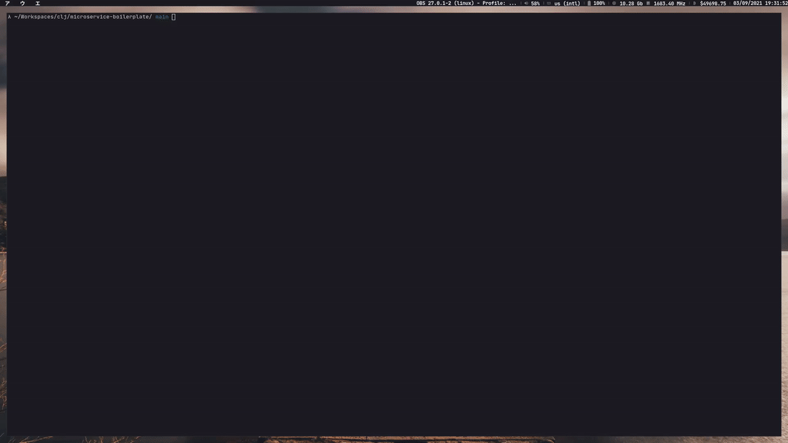  
**`<leader>ff`**

### Lsp - Syntax check
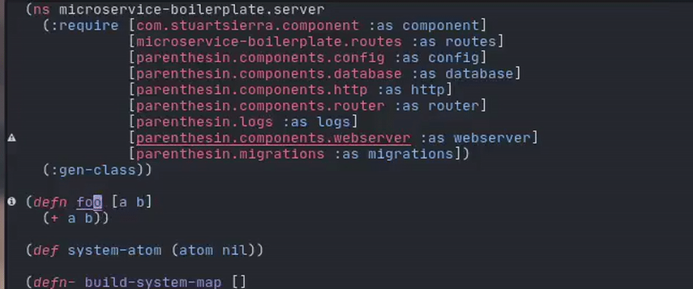  
**`<leader>le`**

### Lsp - Go to definition
  
**`gd`**

### Lsp - Document/Signature Help
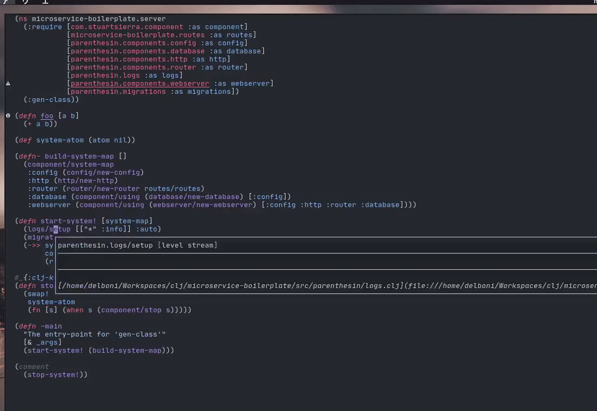  
**`K`/`<leader>lh`**

### Lsp - Find definition/references
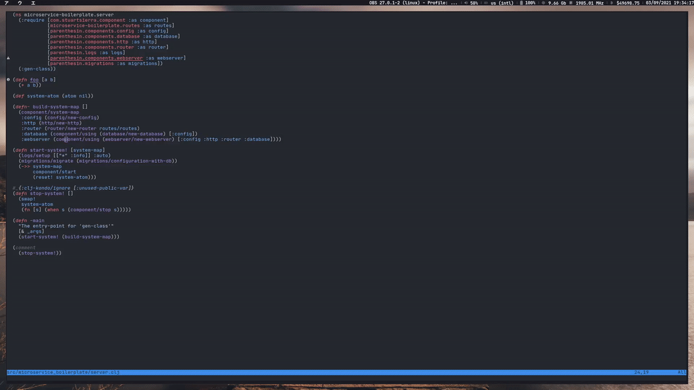  
**`<leader>lr`**

### Lsp - Formatting
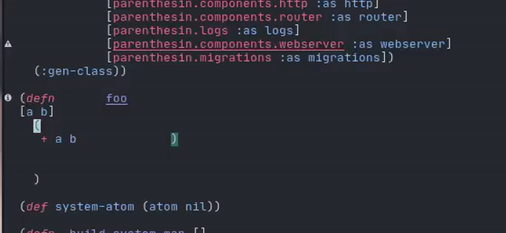  
**`<leader>lf`**

### Lsp - Code actions
  
**`<leader>la`**

### Lsp - Refactorings
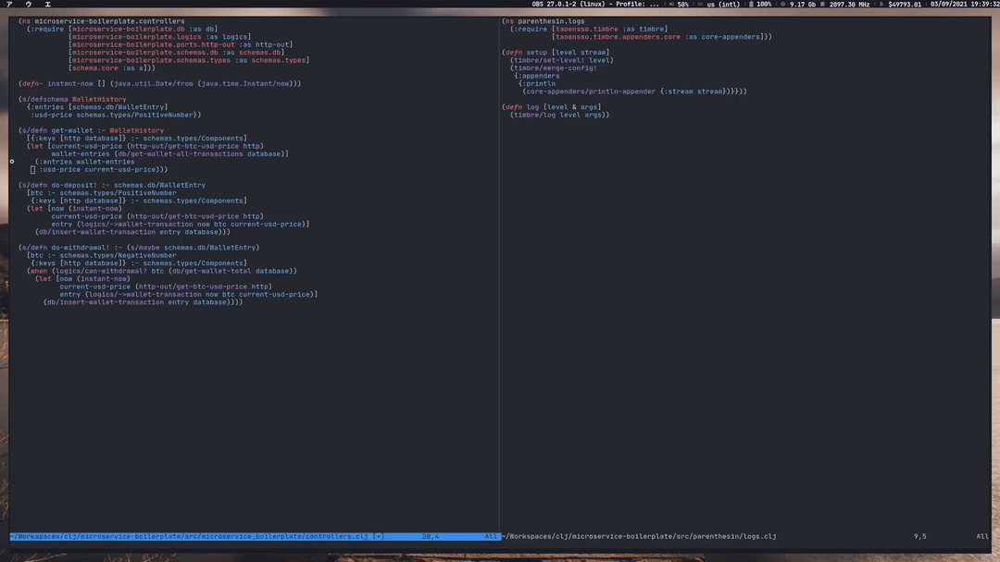  
**`<leader>la`**

### Lsp - Rename
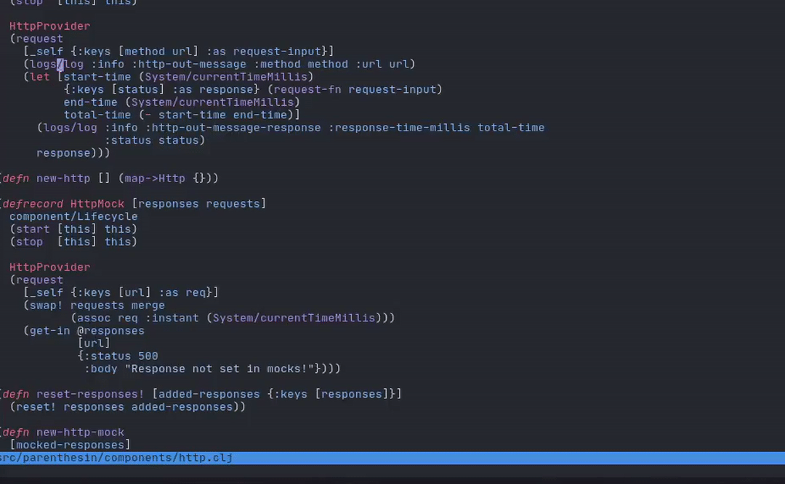  
**`<leader>ln`**

### Conjure - Eval
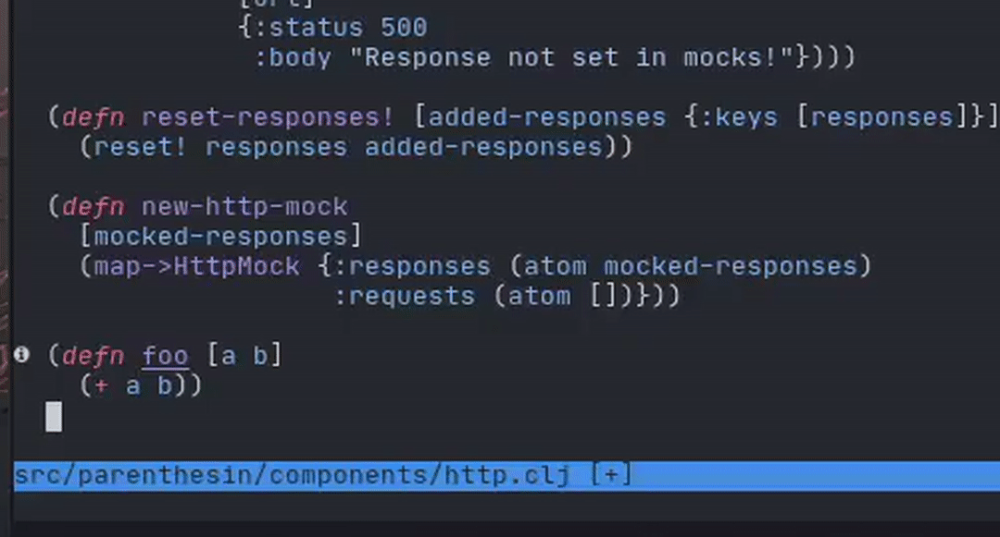  
**`<localleader>er`**

### Conjure - Repl
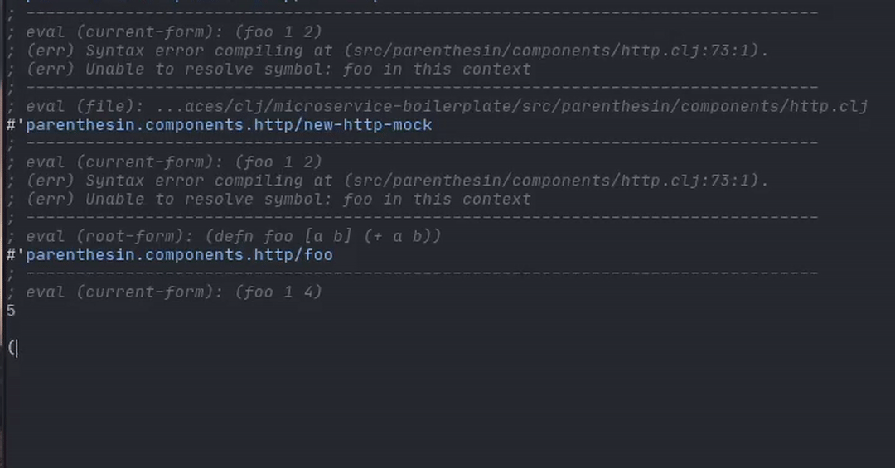  
**`<localleader>lv`**

### Conjure - Document
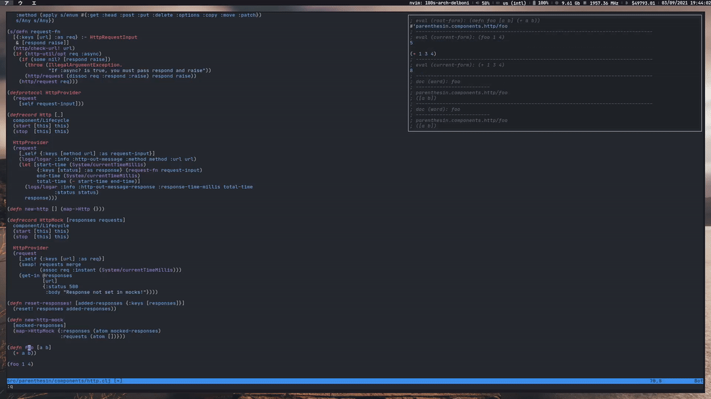  
**`<localleader>K`**

### Completion
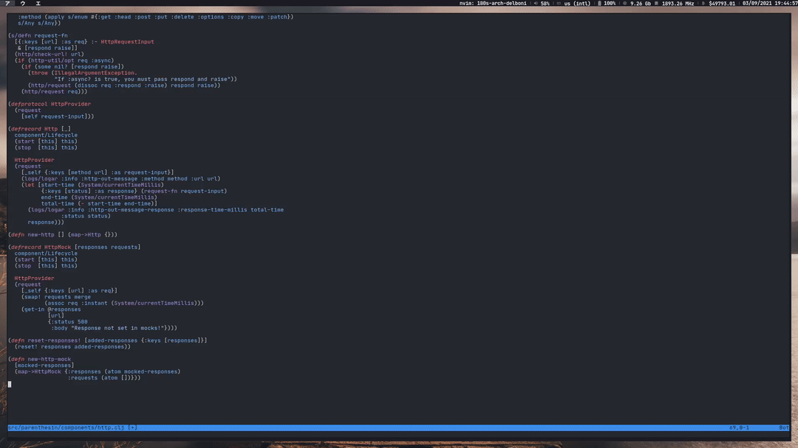  

## Contributing
If you find any dead links, misinformation or any improvements in this documents at all [Emails](https://github.com/rafaeldelboni), [PRs](https://github.com/rafaeldelboni/buildlogs/pulls) and [Issues](https://github.com/rafaeldelboni/buildlogs/issues) are highly encouraged.

## License
This is free and unencumbered software released into the public domain.  
For more information, please refer to <http://unlicense.org>
